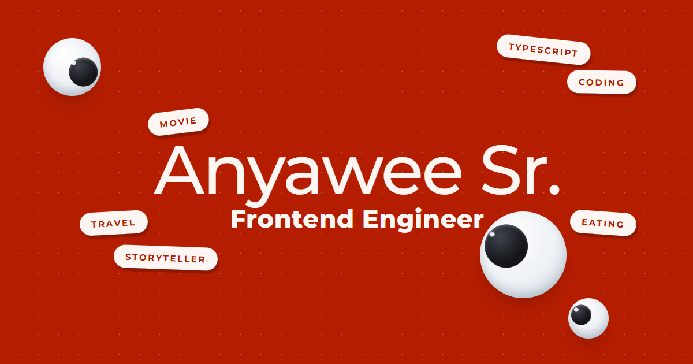

# Anyawee Sr. — Portfolio

Source code for my personal portfolio site, live at **[anyawee-sr.com](https://anyawee-sr.com)**.

It's a Next.js site showcasing selected case studies, built and deployed as a static export to S3 behind CloudFront.

## Highlights

- **Accessibility-first** — focus-visible states, 44×44px touch targets, `prefers-reduced-motion` support, and an a11y checklist enforced before every merge.
- **Decisions on record** — architecture and hosting calls are documented as ADRs in [`docs/adr/`](docs/adr/README.md), with the reasoning kept alongside the decision.
- **Credential-free deploys** — GitHub Actions assumes an AWS IAM role over OIDC on every push to `main`; no long-lived AWS keys live in this repo.
- **AI-assisted** — implemented with Claude Code and Claude Design.

## Tech stack

- [Next.js](https://nextjs.org) 16 (App Router, static export)
- [React](https://react.dev) 19 + TypeScript 5
- [Tailwind CSS](https://tailwindcss.com) v4 — custom design-token system via `@theme`/`@utility`
- [Claude Code](https://claude.com/claude-code) + Claude Design — AI-assisted implementation and visual design
- ESLint 9 + Prettier 3

## Project structure

```
src/
  app/            Next.js App Router routes
  components/     Reusable UI and page sections
  data/           Content (case studies, links, copy)
  lib/            Utilities
docs/             ADRs and project notes
infra/            AWS config snapshots (S3, CloudFront, IAM) — not IaC
design-ref/       Read-only visual reference, not imported by the app
public/           Static assets
```

## Getting started

Requires Node `24.x` (see `engines` in `package.json`).

```bash
git clone git@github.com:anyawee-sr/portfolio-2026.git
cd portfolio-2026
npm install
npm run dev
```

Open [http://localhost:3000](http://localhost:3000)


## Architecture decisions

Non-trivial technical decisions — hosting, component structure, interaction patterns — are recorded as ADRs in [`docs/adr/`](docs/adr/README.md)

## Contact

anyawee.sr@gmail.com · [GitHub](https://github.com/anyawee-sr) · [GitLab](https://gitlab.com/anyawee-sr) · [LinkedIn](https://www.linkedin.com/in/anyawee-sr)